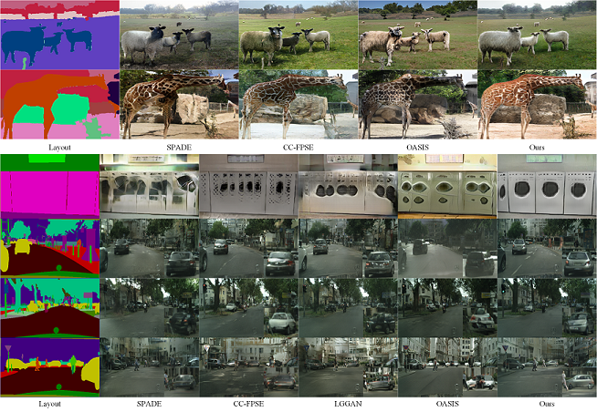
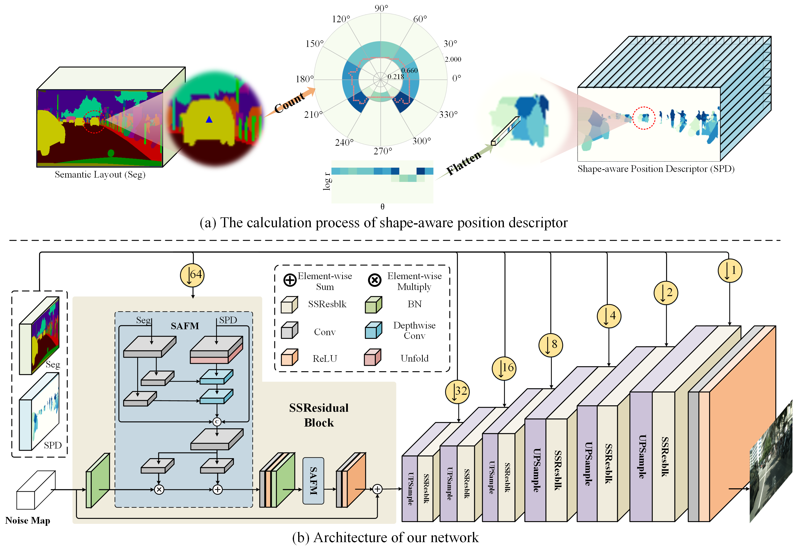

# Semantic-shape Adaptive Feature Modulation for Semantic Image Synthesis

### Introduction

The source code for our paper "Semantic-shape Adaptive Feature Modulation for Semantic Image Synthesis" (CVPR 2022)



### Our Framework



## Quick Start

### Installation

```
git clone https://github.com/cszy98/SAFM.git
cd SAFM
pip install -r requirements.txt
cd models/counter
python setup.py install
```

### Data Preparation

Follow the dataset preparation process in [SPADE](https://github.com/NVlabs/SPADE). Besides, we get the instance maps of ADE20K from [instancesegmentation](https://github.com/CSAILVision/placeschallenge/tree/master/instancesegmentation).

### Testing and Evaluate

The pretrained models can be downloaded from [GoogleDrive](https://drive.google.com/drive/folders/1AtOp25uEk7rpR_VEQEZl0Xri-ayKdPYH?usp=sharing).

```
python test.py --name [experiment_name] --dataset_mode [dataset] --gpu_ids 0 --batchSize 2 --dataroot [path to dataroot] --which_epoch best --instance_root [path to instance maps]
```

### Training

```
python train.py --name [experiment_name] --dataset_mode [dataset] --batchSize 4 --dataroot [path to dataroot] --instance_root [path to instance maps] --save_epoch_freq 5 --niter 100 --niter_decay 100
```

## Acknowledgments

This code borrows heavily from [SPADE](https://github.com/NVlabs/SPADE).

## Citation

If you find our work useful in your research or publication, please cite:

```
@article{lv2022semantic,
  title={Semantic-shape Adaptive Feature Modulation for Semantic Image Synthesis},
  author={Lv, Zhengyao and Li, Xiaoming and Li, Niu Zhenxing, Cao Bing and Zuo, Wangmeng},
  booktitle = {IEEE Conference on Computer Vision and Pattern Recognition},
  year = {2022}
}
```

### Contact

Please send email to cszy98@gmail.com